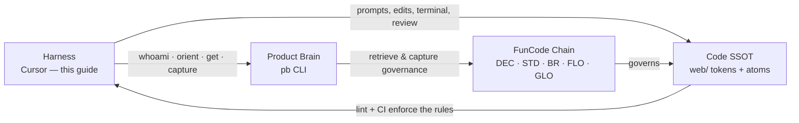

# Cursor, your harness — and Product Brain

**Onboarding guide for working in Cursor** at FunCode. This doc is *not* Chain SSOT — it explains how Cursor works and points at the Chain entries that govern *how we use it*. When in doubt, `pb get <ID>` beats reading this from memory.

**Who this is for:** FunCode team, org partners, and community members building in the open (`AUD-1`, `DEC-21`). Total beginner who's never opened an AI editor? You're in the right place. Already living in Cursor? Skim to "Managing Cursor well."

**Guide contract:** Follows `STD-5` (onboarding guide contract) and the atom decisions `DEC-17`–`DEC-21`. Feed it back into your agent when you need grounding.

> Cursor moves fast — this guide reflects **Cursor 3.6 (mid-2026)**. Model names and exact menus churn; the *patterns* here are durable. The live truth is always [cursor.com/docs](https://cursor.com/docs).

---

## What is Cursor? (30 seconds)

Cursor is a code editor with an AI assistant built in. It's a **fork of VS Code** — Microsoft's popular editor — so it looks and behaves almost identically, and anything you learn transfers both ways.

The difference: AI is woven through everything. You can describe what you want in plain English and Cursor will autocomplete as you type, edit a selection, answer questions about the code, or build a whole feature across many files.

For non-engineers: think of it as a document editor where a patient expert is reading over your shoulder — ready to type for you, explain anything, and make changes when you ask. **You stay the author; Cursor is the hands.**

That's it. You're not memorizing syntax — you're describing outcomes and reviewing what comes back.

---

## Cursor in your stack

You don't build in a vacuum. Cursor is the **Harness** — the agent-capable surface — at the top of the FunCode stack: **harness → Product Brain (`pb`) → Chain → code** (`DEC-19`). Swap Cursor for Claude Code or Codex tomorrow and the rest of the stack is identical; that's the point.



| Layer | What it is | You touch it when… |
|-------|------------|-------------------|
| **Harness (Cursor)** | The AI editor where you write, run, and review | All day — this guide |
| **Product Brain (`pb`)** | CLI to orient, retrieve, and capture on the Chain (`LAND-6`) | Before work, after learnings, session open/close |
| **Chain** | FunCode's knowledge graph — decisions, standards, flows | You need the *why* or the rule (`pb get`) |
| **Code** | `web/` — Tailwind `@theme` tokens + Svelte atoms | You implement something |

> **One harness, go deep.** FunCode runs on a single paid harness (~$200/mo in Cursor — `INS-6`). The workflow is harness-agnostic, but we get good at *one* tool rather than dabbling in five.

**Root bet context (`WP-1`):** FunCode teaches product people to ship prototypes with agents and Product Brain — Play Rooms, not PRDs. Prototype-first, human ratification on the Chain.

---

## Install + first run

```text
Download → sign in → import VS Code settings → open a folder → say hi
```

1. **Download** from [cursor.com/downloads](https://cursor.com/downloads) (macOS 12+, Windows 10+, Linux). Open it and sign in.
2. **Import from VS Code** (one click, optional): Cursor Settings (`Cmd/Ctrl + Shift + J`) → **General → Account → VS Code Import**. Brings your extensions, theme, and keybindings.
3. **Open your project folder**, then open chat with `Cmd/Ctrl + I`.
4. **First task — just ask:** *"Explain this codebase. Point me to the main entry points and anything I should read before making changes."*

**The interface, oriented:**

- **Editor** (center) — your files, same as VS Code.
- **Chat / Agent** (side) — `Cmd/Ctrl + I` or `Cmd/Ctrl + L`. Where you talk to the AI.
- **Terminal** (bottom) — run commands; the agent works here too.
- **Tab indicator** (bottom-right) — controls autocomplete.

**The only four shortcuts you need to start:**

| Do this | Mac | Windows/Linux |
|---------|-----|---------------|
| Open chat / Agent | `Cmd + I` | `Ctrl + I` |
| Inline edit (in editor or terminal) | `Cmd + K` | `Ctrl + K` |
| Accept a Tab suggestion | `Tab` | `Tab` |
| Cycle modes (Ask / Plan / Agent) | `Shift + Tab` | `Shift + Tab` |

> Cursor uses the **Open VSX** extension registry, not the VS Code Marketplace. Most popular extensions are there; a few aren't.

---

## Three ways to talk to Cursor

| Way | How | Best for |
|-----|-----|----------|
| **Tab** (autocomplete) | Type, press `Tab` to accept the grey "ghost text" | Finishing lines, repetitive edits, imports |
| **Inline edit** | Select code → `Cmd/Ctrl + K` → describe the change | Surgical, single-spot edits |
| **Chat / Agent** | `Cmd/Ctrl + I` → describe the task | Anything bigger: multi-file work, questions, builds |

- **Tab** is a prediction, not gospel — read before accepting. Press `Tab` again to *jump* to the next likely edit. Snooze or disable it from the bottom-right indicator if it's noisy in prose files.
- **Inline edit (`Cmd/Ctrl + K`)**: select, describe ("convert this to async"), Enter. Switch to a quick *question* with `Opt/Alt + Return`. Escalate a selection into full Agent with `Cmd/Ctrl + L`.
- **Terminal `Cmd/Ctrl + K`**: describe a command in plain English ("find files larger than 10MB") and Cursor writes it for you to review and run — great when you don't know the shell.

---

## Modes: Ask → Plan → Agent (a ladder)

Same chat panel, three modes. Rotate with `Shift + Tab`.

| Mode | What it can do | Reach for it when… |
|------|----------------|--------------------|
| **Ask** | Read-only. Explains, explores. **No edits.** | "How does this work? Where's X configured?" |
| **Plan** | Researches, asks questions, writes a reviewable plan *before* coding | Bigger or fuzzy changes, several files, real decisions |
| **Agent** | Does the work — edits files, runs terminal, iterates until done | You know what you want; let it build |

**The ladder is the habit:** *understand (Ask) → decide (Plan) → build (Agent).* For a tiny, obvious change, skip straight to Agent.

### Staying in control — Run Modes

Agent can run terminal commands. How freely is set in **Settings → Agents → Approvals & Execution**:

- **Auto-review** *(recommended default)* — trusted commands run; risky ones are screened (sandboxed or checked) before running. Fewer prompts, with a safety net.
- **Allowlist** — only commands you've trusted run automatically. Predictable.
- **Run Everything** — no prompts. Only where you accept the risk.

> Auto-review's safety check is helpful but **not a security boundary**. Keep approval on for anything that deletes, deploys, or touches secrets.

### Reviewing what the agent did — always

- **Read the diff** (red/green changes) before keeping anything. Ask the agent to run the project's checks: `cd web && npm run lint` and the build.
- **Checkpoints** are automatic snapshots — click one in the chat timeline to preview or **Restore** to roll back. They're *local and separate from Git* — handy for undo, **not** real version control.
- **Commit to Git** at meaningful milestones. That's your actual safety net.
- Build drifting off-target? Don't pile on follow-ups — **revert, sharpen the plan, re-run.** Cleaner and usually faster.

---

## Context is everything (and how rules replace "memory")

Good results come from good context. Cursor gets context three ways:

**1. It searches for you.** Opening a project, Cursor builds a semantic "meaning map" (indexing) so it can find "where do we handle auth?" even if that word never appears. Web and codebase search are now **automatic agent tools** — you don't summon them.

**2. You point with `@`.** Type `@` to hand-pick context when you *know* what's relevant:

| `@` mention | Pulls in |
|-------------|----------|
| `@file` / `@folder` | A specific file or folder |
| `@Docs` | Indexed documentation (add your own via `@Docs → Add new doc`) |
| `@Terminals` | Recent terminal output (great for debugging) |
| `@Past Chats` | An earlier conversation |
| `@Commit` / `@Branch` | Your uncommitted changes / full branch diff vs main |
| `@Browser` | Cursor's built-in browser |

Drag-drop or paste (`Cmd/Ctrl + V`) **images** — screenshots, mockups, error shots. The principle: *mention surgically when you know the files; otherwise let the agent search.* Over-stuffing context backfires.

**3. Rules — your persistent house rules.** LLMs forget between messages. Rules are instructions auto-injected every relevant turn, so you don't re-type them.

> **Important for FunCode:** Cursor's old in-editor **"Memories" feature was removed.** Don't expect Cursor to "remember" past sessions. Our persistence layer is **rules + `AGENTS.md` + the `pb` Chain (SSOT)** — which is the more robust pattern anyway.

How rules load at FunCode (they **stack** — it's not either/or):

| Source | What it is |
|--------|-----------|
| **`AGENTS.md`** (root + nested) | Plain-markdown agent instructions. A `web/AGENTS.md` applies inside `web/`; more-specific wins |
| **`.cursor/rules/*.mdc`** | Project rules with frontmatter. **Must be `.mdc`** — a plain `.md` here is silently ignored |
| **`CLAUDE.md`** | FunCode's adapter, loaded by Cursor too |
| **User rules** | Your personal globals (Agent/Chat only — not Tab or inline edit) |

Rule precedence: **Team → Project → User.** FunCode's `AGENTS.md`, `CLAUDE.md`, and `.cursor/rules/` all load together — that's why `pb` and design-system guidance reach every agent.

**Keep secrets out of context.** `.cursorignore` hides files from the agent, but terminal/MCP tools can still read them — so real secrets stay out of the repo entirely. That's the **Waterline** (`BR-3`): credentials and irreversible actions = stop and think.

---

## Choosing a model without burning budget

The model picker sits atop the chat panel (`Cmd/Ctrl + /` cycles). Two routers pick for you: **Auto** (balances quality + cost — the everyday default) and **Premium** (most capable, billed at API rates).

Think in **categories**, not names (names change monthly):

| Your task | Use | Why |
|-----------|-----|-----|
| Everyday edits, Q&A, small features | **Auto** | Cheap, generous included pool — start here |
| Bulk/simple work, drafts | **Fast / small model** | Lowest cost, quick |
| Hard reasoning, gnarly bugs, architecture | **Thinking / reasoning model** | Quality on complex chains, worth it *selectively* |
| Genuinely whole-repo context | **Large-context model + Max Mode** | Only when the *amount of code* is the problem |
| Not sure / non-engineer | **Auto** | Safest and cheapest |

**The one-liner:** *Auto for almost everything → switch to a thinking model only when Auto visibly struggles → reach for Max Mode only when the task truly needs the whole codebase.*

**Manage cost:**
- **Max Mode** is sticky and expensive — turn it on *per-task*, off after.
- Picking a specific model spends the *limited API pool*, not the generous Auto pool — that's how budgets vanish.
- Watch [cursor.com/dashboard/usage](https://cursor.com/dashboard/usage) — it shows per-request cost. FunCode's ~$200/mo maps to the **Ultra** tier; keep daily work on Auto so the API pool lasts the month.

**Privacy Mode** (Settings → General) guarantees your code is never used for training — on by default for teams.

---

## The Product Brain loop, inside Cursor

This is what makes Cursor *FunCode's* harness rather than just an editor. Run this from the **repo root** every time you start real work — paste the whole block into chat:

```bash
# 1. Confirm you're on FunCode — wrong workspace = stop
cd "<repo root>"
pb whoami
# MUST show: workspace FunCode, profile funcode, source repo-local pin

# 2. Open a tracked session
pb session start

# 3. Task-shaped governance (replace the task string)
pb orient --task "<what you're about to do>"

# 4. Read the governing entries — don't work from memory
pb get WP-1     # root bet — why we're here
pb get <ID>     # whatever orient surfaced for your task

# 5. When you're done
pb session close
```

**Capture learnings on the Chain** (not in random markdown — `DEC-3`):

```bash
pb capture -c insights "INS: learned that …"
pb capture -c tensions "TEN: friction with …"
pb capture -c decisions "DEC: decided X because Y"
```

Drafts stay drafts — Randy ratifies governed entries in Product Brain Studio.

> **CLI over MCP** (`DEC-16`): for `pb` and external docs (Context7 / `ctx7`), prefer the CLI. MCP still earns its place for tools like the filesystem, Convex, and Sentry — see "Managing Cursor well."

### Your loop in a Play Room

A **Play Room** is FunCode's sandbox PR — a place to try things in the open, not a production gate (`GLO-2`). This maps to member onboarding (`FLO-1`):

```text
orient → branch → build with the agent → review diff → lint → PR → capture
```

1. **Orient** — `pb orient --task "Play Room: <what you're trying>"`, `pb get` what you need.
2. **Build** — use Ask → Plan → Agent. Compose existing atoms; derive, don't go bespoke (`BR-2`).
3. **Review** — read every diff. `cd web && npm run lint` before review.
4. **PR** — describe what you tried, not a formal spec. Building in the open is the point.
5. **Capture** — what did you learn? `pb capture` + `pb session close`.

**Voice reminder (`STD-4`):** lower the stakes, invite people in. "Try", "tinker", "we're figuring this out too" — not guru posturing. Good-enough ships or gets deleted without shame.

---

## Managing Cursor well (team + club)

For when FunCode runs Cursor across a team and the wider community.

| Capability | What it is | Manage it by… |
|-----------|-----------|---------------|
| **Cloud Agents** | Agents that run in the cloud (not your laptop) — build, test, open PRs in parallel | One admin owns the source-control connection + a shared environment; set a spend limit. **They don't prompt for approval**, so scope secrets carefully |
| **Bugbot** | AI reviewer that comments on PRs | Enable on key repos, a few high-signal Team Rules, require the check in branch protection; keep autofix to a *new branch* |
| **MCP** | Connects the agent to external tools (filesystem, Convex, Sentry, Context7) | Standardize via committed `.cursor/mcp.json`; keys via env vars, never hardcoded; admins set an MCP allowlist |
| **Team rules & analytics** | Org-wide rules + adoption insights | Commit `.cursor/rules` + `AGENTS.md` to git so everyone inherits them; a non-coding organizer can be an **Unpaid Admin** |
| **Privacy Mode** | Code never used for training | Enforce org-wide; secrets in env/Secrets tab, not prompts |

**Safety gotchas worth saying out loud:**
- **Cloud Agents bypass interactive approval** — secrets scoping + MCP allowlists are the real guardrails, not prompts.
- **Auto-run + MCP = real risk** — a tool can read or exfiltrate data. Keep approval on for sensitive servers.
- **Checkpoints aren't backups** — commit to Git.
- **`.cursorignore` isn't a security boundary** — keep secrets out of the repo (`BR-3`).

---

## Cursor → Product Brain feedback

Friction with **Cursor itself** (a confusing menu, a missing feature) is *product feedback*, not FunCode Chain knowledge. Friction with **`pb` itself** goes to the **pb-feedback loop** (`DEC-15`), not the Chain.

| What | Where |
|------|-------|
| FunCode community knowledge | Chain — `pb capture` |
| Product Brain tool feedback | [`.productbrain/Docs/02. Areas/pb-feedback/`](../pb-feedback/README.md) |

---

## Chain entry reference

Retrieve full specs anytime — these are pointers, not copies:

| ID | Run | What |
|----|-----|------|
| `WP-1` | `pb get WP-1` | Root bet — Build with AI community |
| `FLO-1` | `pb get FLO-1` | Member onboarding flow |
| `GLO-2` | `pb get GLO-2` | Play Room = sandbox PR |
| `AUD-1` | `pb get AUD-1` | FunCode member ICP |
| `INS-6` | `pb get INS-6` | Single-harness insight |
| `LAND-6` | `pb get LAND-6` | Product Brain landscape entity |
| `DEC-3` | `pb get DEC-3` | Markdown is output; Chain is SSOT |
| `DEC-15` | `pb get DEC-15` | pb-feedback loop |
| `DEC-16` | `pb get DEC-16` | CLI over MCP for pb and ctx7 |
| `BR-2` | `pb get BR-2` | Derive or update — no bespoke |
| `BR-3` | `pb get BR-3` | The Waterline — recoverable vs ship-sinking |
| `STD-4` | `pb get STD-4` | FunCode voice & copy |
| `STD-5` | `pb get STD-5` | Onboarding guide contract (this doc's shape) |
| `DEC-19` | `pb get DEC-19` | Always frame harness + Product Brain |
| `DEC-21` | `pb get DEC-21` | Team, org, and community audience |

```bash
pb context WP-1            # constellation around the root bet
pb search "onboarding"     # find related entries
pb collections list        # discover collections before capture
```

---

## Agent prompt block

Paste this entire section (or the full doc) into any harness when onboarding to FunCode work in Cursor.

~~~markdown
You are working in Cursor on FunCode (Build with AI) — a free community that teaches people to ship prototypes with agents and Product Brain.

## Workspace guard
Run from repo root. `pb whoami` MUST show workspace FunCode, profile funcode, source repo-local pin. Wrong workspace → STOP.

## Start every task
    pb session start
    pb orient --task "<describe the task>"
    pb get WP-1   # plus whatever orient surfaces

## How Cursor fits
- Cursor is the HARNESS. Stack: harness → Product Brain (pb) → Chain → code (DEC-19).
- Persistence = rules + AGENTS.md + the pb Chain. Cursor has no durable "memory."
- Modes ladder: Ask (understand) → Plan (decide) → Agent (build).
- Run Mode: keep Auto-review; require approval for delete/deploy/secrets.

## Context discipline
- Let the agent search; @-mention files only when you know they're relevant.
- Rules live in .cursor/rules/*.mdc (must be .mdc) + AGENTS.md (root + nested) + CLAUDE.md — they stack.

## Models & cost
- Default to Auto. Escalate to a thinking model only when Auto struggles. Max Mode per-task only.

## Build loop (Play Room — GLO-2)
- Compose existing atoms; derive, never bespoke (BR-2).
- Review every diff. Run: cd web && npm run lint. Commit to Git (checkpoints aren't backups).

## Safety (BR-3 — the Waterline)
- Secrets/credentials never in prompts or repo. .cursorignore is not a security boundary.
- Cloud Agents + auto-run MCP don't prompt — scope them carefully.

## Capture & close
    pb capture -c insights "INS: …"
    pb session close

## Do NOT
- Duplicate Chain specs into new markdown (DEC-3).
- Send Product Brain tool feedback to the Chain — use .productbrain/Docs/02. Areas/pb-feedback/.
- Invent Chain IDs from memory — always pb get.
~~~

---

## Quick checklist

- [ ] Cursor installed, VS Code settings imported
- [ ] `pb whoami` → FunCode, then `pb session start` + `pb orient --task "…"`
- [ ] Know the 4 shortcuts: `Cmd/Ctrl+I`, `Cmd/Ctrl+K`, `Tab`, `Shift+Tab`
- [ ] Ladder: Ask → Plan → Agent; Run Mode on **Auto-review**
- [ ] Context: let it search, `@`-mention surgically; rules + `AGENTS.md` do the remembering
- [ ] Model on **Auto**; escalate only when needed; Max Mode per-task
- [ ] Reviewed the diff, ran `npm run lint`, committed to Git
- [ ] Play Room PR opened — building in the open
- [ ] Learnings captured on the Chain; `pb session close`

You've got this. Describe outcomes, review honestly, and let the Chain — not Cursor's memory — hold what matters.
