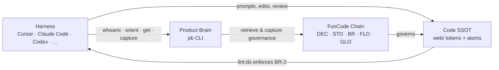

# Design system, harness, and Product Brain

**Main onboarding guide** for FunCode UI work. This doc is *not* Chain SSOT — it points at Chain entries and shows you where things live in code. When in doubt, `pb get <ID>` beats reading this file from memory.

**Who this is for:** FunCode team, org partners, and community members building in the open (`AUD-1`, `DEC-21`). Whether you're in Cursor, Claude Code, Codex, or another agent harness — the pattern is the same: **harness + Product Brain (`pb`) + Chain + code** (`DEC-19`).

**Guide contract:** This doc follows `STD-5` (onboarding guide contract) and the atom decisions `DEC-17`–`DEC-21`. Feed it back into your agent when you need grounding.

---

## What is a design system? (30 seconds)

A design system is the shared visual language of a product — colors, spacing, typography, and reusable UI pieces — so every screen feels like the same product and you don't reinvent buttons on every page.

For FunCode:

- **Code is the implementation SSOT** — tokens in CSS, atoms in Svelte (`DEC-11`).
- **The Chain is the governance SSOT** — standards agents retrieve with `pb` before they touch UI.
- **The rule is simple:** derive from what exists, or update the system together with Product Design (`BR-2`, `ROL-2`). No one-off bespoke UI because it felt faster.

That's it. You're not memorizing hex codes — you're reusing tokens and atoms, and extending them when something's genuinely missing.

---

## Your stack

You don't build UI in a vacuum. You sit in a stack: your **harness** (the agent IDE or CLI you use), **Product Brain** (the `pb` CLI connected to FunCode's Chain), the **Chain** (durable knowledge), and **code** (where the design system actually runs).



| Layer | What it is | You touch it when… |
|-------|------------|-------------------|
| **Harness** | Any agent-capable editor or CLI | Writing code, running terminal, opening PRs |
| **Product Brain (`pb`)** | CLI to orient, retrieve, and capture on the Chain (`LAND-6`) | Before UI work, after learnings, session open/close |
| **Chain** | FunCode's knowledge graph — decisions, standards, flows | You need the *why* or the rule (`pb get`) |
| **Code** | `web/` — Tailwind `@theme` tokens + Svelte atoms | You implement UI |

> **One harness, go deep.** FunCode often runs on a single paid harness (~$200/mo in Cursor — `INS-6`), but the workflow here is **harness-agnostic**: swap Cursor for Claude Code or Codex; keep `pb` and the Chain.

**Root bet context (`WP-1`):** FunCode teaches product people to ship prototypes with agents and Product Brain — Play Rooms, not PRDs — prototype-first, human ratification on the Chain.

---

## Before you touch UI

Run this from the **repo root** every time you (or your agent) start UI work. Copy the whole block into your harness.

```bash
# 1. Confirm you're on FunCode — wrong workspace = stop
cd "<repo root>"
pb whoami
# MUST show: workspace FunCode, profile funcode, source repo-local pin

# 2. Open a tracked session
pb session start

# 3. Task-shaped governance (replace the task string)
pb orient --task "UI work in web/ — design system tokens and atoms"

# 4. Read the governing entries — do not work from memory
pb get DEC-11   # design system decision
pb get STD-1    # tokens
pb get STD-2    # icons
pb get STD-3    # atoms
pb get BR-2     # derive or update, never bespoke
pb get ROL-2    # Product Design owns the system

# 5. When you're done for the day
pb session close
```

**Capture learnings on the Chain** (not in random markdown):

```bash
pb capture -c insights "INS: learned that …"
pb capture -c tensions "TEN: friction with …"
pb capture -c decisions "DEC: decided X because Y"
```

Drafts stay drafts — Randy ratifies governed entries in Product Brain Studio.

---

## The three layers

Think top-down: **pages** compose **atoms**, atoms consume **tokens**.

### Layer 1 — Tokens (`STD-1`)

**Where:** `web/src/routes/layout.css` inside `@theme`.

Tokens are semantic by role — not raw hex sprinkled in components. Brand orange splits into display accent (`accent`) and action accent (`accent-strong`, AA-safe for buttons and small text).

```css
@theme {
  --color-ink: #0b0b0f;
  --color-ink-soft: #3a3a44;
  --color-accent: #ff5722;           /* display — large text, tints */
  --color-accent-strong: #d23c0a;  /* action — buttons, small text */
  --radius-card: 1rem;
  --shadow-card: 0 10px 30px -12px rgb(255 87 34 / 0.25);
}
```

**In components, use utilities — not hardcoded values:**

```svelte
<!-- ✅ Good -->
<section class="rounded-card bg-accent-soft p-6 shadow-card">
  <h2 class="text-ink">Play Room</h2>
  <p class="text-ink-soft">Poke at ideas here — no production gate.</p>
</section>

<!-- ❌ Bad — lint:ds will fail -->
<section class="rounded-[17px] bg-[#ffe5dd] p-[24px]">
```

**Rule of thumb:** if it's color, radius, shadow, or spacing that defines *look*, it comes from `@theme`.

---

### Layer 2 — Atoms (`STD-2`, `STD-3`)

**Where:** `web/src/lib/components/ui/`

| Atom | Use for |
|------|---------|
| `Icon` | Lucide icons via unplugin-icons |
| `Button` | All clickable actions — never raw `<button>` |
| `Badge` | Labels, status chips |
| `Card` | Grouped content surfaces |
| `Accordion` | Expand/collapse sections |
| `Avatar` | People, faces, initials |
| `Testimonial` | Quote blocks |
| `Marquee` | Scrolling strips |

**Import from the barrel:**

```svelte
<script lang="ts">
  import { Button, Card, Badge, Icon } from '$lib/components/ui';
  import IconSparkles from '~icons/lucide/sparkles';
</script>

<Card class="space-y-4 p-6">
  <Badge>New</Badge>
  <h3 class="text-lg font-semibold text-ink">Try the Play Room</h3>
  <p class="text-ink-soft">Fork, tinker, open a PR — we're figuring this out too.</p>
  <Button href="/play-room">
    {#snippet leading()}
      <Icon icon={IconSparkles} size={18} class="text-white" />
    {/snippet}
    Let's go
  </Button>
</Card>
```

**Icons (`STD-2`):** import build-time from Lucide — never inline `<svg>`, never runtime icon APIs.

```svelte
<script lang="ts">
  import Icon from '$lib/components/ui/Icon.svelte';
  import IconHeart from '~icons/lucide/heart';
</script>

<Icon icon={IconHeart} size={20} class="text-accent" aria-label="Favorite" />
```

---

### Layer 3 — Pages

Pages in `web/src/routes/` **compose atoms** and apply layout. They should read like a recipe:

1. Retrieve governance (`pb orient --task "…"`).
2. Reuse existing atoms.
3. Use token utilities for any themed styling.
4. Run the guard before you call it done.

Don't invent page-local components that duplicate atoms. If you need a new pattern twice, that's a signal to **update Layer 2** with Product Design (`ROL-2`).

---

## BR-2: derive or update — never bespoke

`BR-2` is the guardrail that keeps FunCode looking like FunCode.

| Situation | Do this |
|-----------|---------|
| Need a button | Use `Button` atom |
| Need an icon | `~icons/lucide/*` + `Icon` atom |
| Need brand color | Token utility (`bg-accent-strong`, `text-ink`, …) |
| System lacks something | **Update** the system — new token or atom in `web/` **and** capture on Chain under `ROL-2` |
| "I'll just style this once" | **Stop.** That's bespoke. Extend the system or ask. |

**Wanting to build is not authorization** (`BR-1`). Derive-or-update routes real gaps through governed design-system change.

**Enforcement:** code, not vibes.

```bash
cd web && npm run lint:ds
# Also runs as part of: npm run lint (and CI)
```

The guard (`web/scripts/check-design-system.mjs`) catches hardcoded hex, arbitrary themed values, inline `<svg>`, and raw `<button>` elements.

---

## Play Room workflow

A **Play Room** is FunCode's sandbox PR — a place to try ideas in the open, not a production gate (`GLO-2`). Review signals serious intent to merge value; until then, poke at things freely.

This maps to member onboarding (`FLO-1`):

1. `pb connect` → FunCode workspace  
2. Clone or fork the community template repo  
3. `pb whoami` — verify FunCode profile  
4. `pb orient` for your first task  
5. Open your first Play Room and ship a prototype draft  

### Your loop in the Play Room

```text
orient → branch → compose atoms → lint:ds → PR → capture learnings
```

**Step by step:**

1. **Orient** — `pb orient --task "Play Room: <what you're trying>"` and `pb get` the entries you need.
2. **Branch** — small, focused Play Room branch. PRs are a playground — building in the open is the point.
3. **Compose** — Layer 2 atoms + Layer 1 tokens only. No bespoke escapes.
4. **Lint** — `cd web && npm run lint:ds` (or full `npm run lint`). Fix before review.
5. **Open PR** — describe what you tried, not a formal spec. Link Chain IDs if you touched governance.
6. **Capture** — what did you learn?

```bash
pb capture -c insights -n "Play Room: accordion spacing" \
  -d "Learned that …" --source-ref "<PR URL>"
pb session close
```

**Voice reminder (`STD-4`):** lower the stakes, invite people in. "Try", "tinker", "we're figuring this out too" — not guru posturing or enterprise gravity.

---

## Product Brain tool feedback (not Chain)

Friction with **`pb` itself** — CLI quirks, agent UX, governance surprises — goes to the **pb-feedback loop** (`DEC-15`), not the FunCode Chain.

| What | Where |
|------|-------|
| FunCode community knowledge | Chain — `pb capture` |
| Product Brain product feedback | [`.productbrain/Docs/02. Areas/pb-feedback/`](../../pb-feedback/README.md) |

Read [`pb-reports.md`](../../pb-feedback/pb-reports.md) first for answers already shipped. Append new items to [`feedback-log.md`](../../pb-feedback/feedback-log.md) using the `FB-NNN` schema.

---

## Chain entry reference

Retrieve full specs anytime:

| ID | Run | What |
|----|-----|------|
| `WP-1` | `pb get WP-1` | Root bet — Build with AI community |
| `FLO-1` | `pb get FLO-1` | Member onboarding flow |
| `GLO-2` | `pb get GLO-2` | Play Room = sandbox PR |
| `DEC-11` | `pb get DEC-11` | Design system decision |
| `STD-1` | `pb get STD-1` | Design tokens |
| `STD-2` | `pb get STD-2` | Icon standard |
| `STD-3` | `pb get STD-3` | Atom component contract |
| `STD-4` | `pb get STD-4` | FunCode voice & copy |
| `BR-2` | `pb get BR-2` | Derive or update — no bespoke |
| `ROL-2` | `pb get ROL-2` | Product Design role |
| `INS-6` | `pb get INS-6` | Single harness insight |
| `LAND-6` | `pb get LAND-6` | Product Brain landscape entity |
| `DEC-15` | `pb get DEC-15` | pb-feedback loop decision |
| `STD-5` | `pb get STD-5` | Onboarding guide contract (this doc's shape) |
| `DEC-17` | `pb get DEC-17` | Zero-context, agent-feedable primers |
| `DEC-18` | `pb get DEC-18` | Human-and-agent dual optimized |
| `DEC-19` | `pb get DEC-19` | Always frame harness + Product Brain |
| `DEC-20` | `pb get DEC-20` | Play Room community context |
| `DEC-21` | `pb get DEC-21` | Team, org, and community audience |
| `AUD-1` | `pb get AUD-1` | FunCode member ICP |
| `BR-1` | `pb get BR-1` | Builds need Chain authorization |
| `DEC-16` | `pb get DEC-16` | CLI over MCP for pb and ctx7 |
| `INS-21` | `pb get INS-21` | This onboarding area shipped |

```bash
pb context WP-1    # constellation around the root bet
pb search "design system"   # find related entries
pb collections list         # discover collections before capture
pb fields decisions         # schema before writing DEC entries
```

---

## Agent prompt block

Paste this entire section (or the full doc) into any harness when starting FunCode UI work.

~~~markdown
You are working on FunCode (Build with AI) — a free community that teaches people to ship prototypes with agents and Product Brain.

## Workspace guard
Run from repo root. `pb whoami` MUST show workspace FunCode, profile funcode, source repo-local pin. Wrong workspace → STOP.

## Before UI changes
    pb session start
    pb orient --task "<describe the UI task>"
    pb get DEC-11 STD-1 STD-2 STD-3 STD-5 BR-1 BR-2 ROL-2

## Design system (BR-2)
- DERIVE from existing tokens (web/src/routes/layout.css @theme) and atoms (web/src/lib/components/ui/).
- Icons: import from ~icons/lucide/name + Icon atom. Never inline svg.
- Colors/spacing/radius: token utilities only. No hardcoded hex or arbitrary themed values.
- Buttons: Button atom only. Never raw button elements.
- If the system lacks something: UPDATE it with Product Design (ROL-2) — extend code AND capture on Chain. Never bespoke one-offs.

## Atoms available
Icon, Button, Badge, Card, Accordion, Avatar, Testimonial, Marquee — import from $lib/components/ui.

## Verify
    cd web && npm run lint:ds

## Play Room context (GLO-2)
PRs are sandbox Play Rooms — building in the open, not a production gate. Lower stakes, prototype-first.

## Capture & close
    pb capture -c insights "INS: …"
    pb session close

## Do NOT
- Duplicate Chain specs into new markdown files
- Capture Product Brain tool feedback to Chain — use .productbrain/Docs/02. Areas/pb-feedback/
- Invent Chain IDs from memory — always pb get
~~~

---

## Quick checklist

- [ ] `pb whoami` → FunCode
- [ ] `pb session start` + `pb orient --task "…"`
- [ ] `pb get DEC-11 STD-1 STD-2 STD-3 BR-2 ROL-2`
- [ ] Tokens from `@theme`, atoms from `$lib/components/ui`
- [ ] `cd web && npm run lint:ds` passes
- [ ] Play Room PR opened — building in the open
- [ ] Learnings captured on Chain; `pb session close`

You've got this. Tinker boldly, derive honestly, and extend the system when something's genuinely missing.
