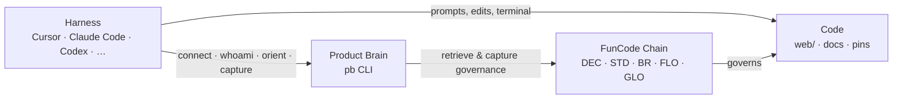
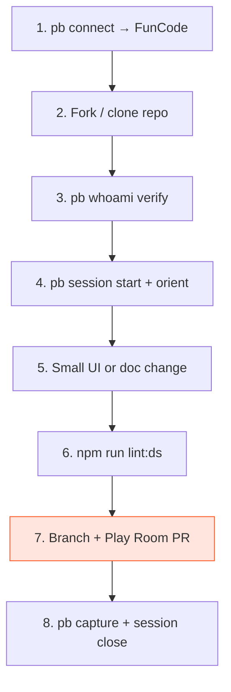

# Your first Play Room in 15 minutes

**The fastest path from "I just joined FunCode" to "I opened a Play Room PR."** This doc is *not* Chain SSOT — it points at Chain entries and shows you what to run. When in doubt, `pb get <ID>` beats reading this file from memory.

**Who this is for:** FunCode team, org partners, and community members building in the open (`AUD-1`, `DEC-21`). Whether you're in Cursor, Claude Code, Codex, or another agent harness — the pattern is the same: **harness → Product Brain (`pb`) → Chain → code** (`DEC-19`).

**Guide contract:** This doc follows `STD-5` and the atom decisions `DEC-17`–`DEC-21`. Feed it back into your agent when you need grounding.

**Outcome (`FLO-1`):** You have a Chain-connected workspace and a shipped Play Room prototype draft — a small change in a PR, building in the open.

---

## What you're about to do (30 seconds)

FunCode teaches product people to ship prototypes with agents and Product Brain — Play Rooms, not PRDs (`WP-1`). A **Play Room** is a sandbox PR: a place to tinker in the codebase with others watching, not an exam you pass or fail (`GLO-2`, `INS-18`).

In ~15 minutes you will:

1. Connect Product Brain to the FunCode workspace
2. Fork or clone the community starter repo
3. Verify you're on the right Chain
4. Open a tracked session and orient for your first task
5. Make one small UI or doc change (design system rules apply)
6. Run the design-system guard
7. Open a Play Room PR — sandbox, not gate
8. Capture what you learned and close your session

No production drama. Good-enough work stays, gets merged later, or gets deleted — all fine.

---

## Your stack

You don't work in a vacuum. Every step below sits in four layers:



| Layer | What it is | You touch it when… |
|-------|------------|-------------------|
| **Harness** | Any agent-capable editor or CLI | Running commands, editing files, opening PRs |
| **Product Brain (`pb`)** | CLI connected to FunCode's Chain | Session start, orient, get, capture |
| **Chain** | Durable knowledge — decisions, standards, flows | You need the *why* or the rule |
| **Code** | This repo — SvelteKit site, docs, `.productbrain/` pin | You ship the prototype |

> **One harness, go deep.** Many members run Cursor, but this workflow is harness-agnostic: swap the editor, keep `pb` and the Chain.

---

## The flow at a glance



Text version if mermaid doesn't render:

```text
connect → fork/clone → whoami → session+orient → change → lint:ds → PR → capture+close
```

---

## Before you start — prerequisites

| You need | Notes |
|----------|-------|
| **GitHub account** | To fork and open PRs |
| **Node.js 20+** | For `web/` (check with `node -v`) |
| **Product Brain CLI (`pb`)** | [Install Product Brain](https://productbrain.io) if you don't have it |
| **An agent harness** | Cursor, Claude Code, Codex, or terminal + your editor of choice |
| **~15 minutes** | Seriously — keep the first change tiny |

**Waterline check (`BR-3`):** Everything in this guide is **above the waterline** — recoverable, reversible, safe to move fast. If you hit secrets, real member data, force-push to `main`, or public brand commitments — stop and get explicit sign-off first.

---

## Step 1 — Connect Product Brain to FunCode

Product Brain is the CLI that talks to FunCode's Chain. "Connect" means your local `pb` is pointed at the **FunCode** workspace — not Product Brain's own workspace or some other org.

```bash
# From any directory — connect to FunCode
pb connect FunCode
```

If you're invited via Product Brain Studio, follow the workspace invite flow there, then confirm locally:

```bash
pb whoami
# MUST eventually show: workspace FunCode, profile funcode
```

**What success looks like:** `pb whoami` returns JSON with `"workspace":"FunCode"`. If it shows a different workspace → **stop**. Wrong Chain means wrong governance.

**Agent note:** Never capture FunCode knowledge while connected to the Product Brain workspace. The repo-local pin (Step 2) adds a second guard — see Step 3.

---

## Step 2 — Fork or clone the starter repo (`DEC-8`)

FunCode's member starter template **is this repo**. It ships with:

- Repo-local `pb` pin (FunCode workspace guard)
- `CLAUDE.md` / `AGENTS.md` agent adapters
- Cursor rules, design system, eval specs
- PARA docs under `.productbrain/Docs/`

**Recommended: fork on GitHub, then clone your fork.**

```bash
# 1. Fork on GitHub (browser):
#    https://github.com/synergyai-os/funcode-community-marketing
#    → Fork to your account

# 2. Clone YOUR fork (replace YOUR_USER)
git clone https://github.com/YOUR_USER/funcode-community-marketing.git
cd funcode-community-marketing

# 3. Install web dependencies (needed for lint:ds later)
cd web && npm install && cd ..
```

**Alternative: clone upstream directly** (fine for read-only exploration; fork before you open a PR):

```bash
git clone https://github.com/synergyai-os/funcode-community-marketing.git
cd funcode-community-marketing
cd web && npm install && cd ..
```

**Why fork?** Your Play Room PRs come from your fork or a branch — building in the open without needing write access to upstream on day one.

---

## Step 3 — Verify workspace (`pb whoami`)

Every `pb` command in FunCode work runs from **repo root**. The repo-local pin is the guardrail that keeps agents on the FunCode Chain.

```bash
cd funcode-community-marketing   # or your clone path
pb whoami
```

**MUST show:**

| Field | Expected value |
|-------|----------------|
| `workspace` | `FunCode` |
| `profile` | `funcode` |
| `source` | `local` (repo-local pin) |

```bash
# Example of what you want to see (fields may vary slightly):
# {"workspace":"FunCode","profile":"funcode","source":"local",...}
```

**Wrong workspace?** → **STOP.** Do not `pb capture`. Fix connect/pin first:

```bash
pb connect FunCode
pb whoami   # re-check from repo root
```

This guard exists because capturing to the wrong workspace pollutes governance (`DEC-4`). Agents: treat a failed whoami as a hard stop.

---

## Step 4 — Session start + orient for your first task

Open a tracked write session and load task-shaped governance before you touch code.

```bash
cd "<repo root>"

# Open tracked session (refreshes context)
pb session start

# Task-shaped governance — replace the quoted task
pb orient --task "First Play Room — onboarding prototype change in web/ or Docs"

# Read the flow and Play Room context — do not work from memory
pb get FLO-1
pb get GLO-2
pb get INS-18
pb get WP-1
pb get BR-1
pb get BR-3
```

**What `pb orient --task` does:** Surfaces Chain entries relevant to *this* task — decisions, standards, tensions — so you and your agent aren't guessing.

**Authorization (`BR-1`):** Your first Play Room is authorized by `FLO-1` (member onboarding flow). Point at it; silence is not authorization.

---

## Step 5 — Make one small change

Keep it tiny. The goal is to *feel* the loop, not to ship a feature.

Pick **one**:

| Option | Good first change | Governs |
|--------|-------------------|---------|
| **A. UI copy** | Tweak one line on the landing page — lower stakes, peer voice (`STD-4`) | Design system + voice |
| **B. UI atom** | Add a `Badge` or swap a raw element for a `Button` atom | `BR-2`, `DEC-11` |
| **C. Docs** | Fix a typo in `.productbrain/Docs/` (this folder) | Docs are working notes, not Chain SSOT |

**For UI work:** follow the design system — tokens, atoms, no bespoke escapes. Full depth lives in the sibling guide:

→ **[Design system + harness + Product Brain](./design-system-with-harness-and-productbrain.md)**

**Minimal UI example** (Option A — copy only, still use tokens):

```bash
# Orient for UI specifically
pb orient --task "First Play Room — landing copy tweak using design system"
pb get DEC-11 STD-1 STD-4 BR-2
```

Edit something small in `web/src/routes/` — e.g. one headline or helper line. Use token utilities (`text-ink`, `text-ink-soft`), not hardcoded hex. Voice: try, tinker, we're figuring this out too — not "master the enterprise workflow."

**Minimal doc example** (Option C):

```bash
pb orient --task "First Play Room — fix typo in onboarding README"
```

Edit `.productbrain/Docs/02. Areas/Onboarding/README.md` — one line, no new files unless you're extending the onboarding set deliberately.

**Do NOT:**

- Create new markdown files outside `.productbrain/Docs/` without explicit ask (`DEC-3`)
- Duplicate Chain specs into docs — link with `pb get`
- Invent bespoke UI because it felt faster (`BR-2`)

---

## Step 6 — Run the design-system guard

If you touched anything under `web/`, run the guard before you call it done:

```bash
cd web && npm run lint:ds
```

**What it catches:** hardcoded hex, arbitrary themed Tailwind values, inline `<svg>`, raw `<button>` elements — the usual "agent went rogue" escapes (`BR-2`, code-enforced).

If you only changed docs, skip this step. If you changed UI and lint fails, fix or derive properly — don't `--no-verify` your way past it.

Full lint (optional, broader):

```bash
cd web && npm run lint
```

---

## Step 7 — Open your Play Room (branch + PR)

A Play Room is a **sandbox PR** — building in the open, not a production gate (`GLO-2`, `INS-18`). Review means "this might be worth keeping," not "you passed the exam."

```bash
# From repo root
git checkout -b playroom/first-onboarding-tweak

git add -A
git status   # sanity check — no .env, no secrets

git commit -m "Play Room: first onboarding tweak — <one line what you tried>"

git push -u origin HEAD
```

**Open the PR** (GitHub UI or `gh`):

```bash
gh pr create --title "Play Room: first onboarding tweak" --body "$(cat <<'EOF'
## What I tried
One sentence — lower the stakes, no corporate gravity.

## Chain context
- Authorized by: FLO-1 (first Play Room onboarding)
- Mental model: GLO-2 / INS-18 — sandbox, not gate

## Checklist
- [ ] pb whoami → FunCode
- [ ] lint:ds passed (if UI)
- [ ] Above the waterline (BR-3)

EOF
)"
```

**Play Room norms:**

- **Small PRs welcome.** A one-line copy change is a valid Play Room.
- **Draft PRs are fine.** "Still poking at this" is allowed.
- **Delete or abandon freely.** No shame — the sandbox is for learning.
- **Merge is a signal**, not a verdict. Good-enough work graduates; the rest doesn't.

**Waterline (`BR-3`):** This first PR is above the waterline. Don't commit secrets, member PII, or fabricated testimonials — ever below the line.

---

## Step 8 — Capture learnings + close session

Durable knowledge goes on the **Chain**, not in random notes.

```bash
cd "<repo root>"

# Insight — what you learned (draft until Randy ratifies)
pb capture -c insights \
  -n "First Play Room: onboarding loop felt …" \
  -d "Completed FLO-1 steps. Learned that …" \
  --source-ref "<your PR URL>"

# Optional — friction you hit
pb capture -c tensions \
  -n "First Play Room friction: …" \
  -d "What got in the way and where."

# Close the loop
pb session close
```

**Capture hygiene:**

| Collection | Use for |
|------------|---------|
| `insights` | Learnings grounded in what you did |
| `tensions` | Friction, bugs, contradictions |
| `questions` | Open forks — *not* every question is a tension |
| `decisions` | Choices you made + rationale (draft — human ratifies) |

**Product Brain tool feedback** (CLI quirks, agent UX) → [pb-feedback folder](../../pb-feedback/README.md), **not** the Chain.

Drafts stay drafts. Randy ratifies governed entries in Product Brain Studio.

---

## Done? Quick checklist

- [ ] `pb connect FunCode` + clone/fork (`DEC-8`)
- [ ] `pb whoami` → workspace **FunCode**, profile **funcode**, source **local**
- [ ] `pb session start` + `pb orient --task "…"`
- [ ] `pb get FLO-1 GLO-2 INS-18` (at minimum)
- [ ] One small change — UI via [design system guide](./design-system-with-harness-and-productbrain.md) or doc fix
- [ ] `cd web && npm run lint:ds` (if UI touched)
- [ ] Play Room PR open — sandbox, not gate
- [ ] `pb capture` learnings + `pb session close`

You did it. Your first Play Room doesn't have to be clever — it has to exist.

---

## Chain IDs — retrieve, don't memorize

| ID | Retrieve | Why it matters here |
|----|----------|---------------------|
| `FLO-1` | `pb get FLO-1` | This guide's flow — onboarding to first Play Room |
| `GLO-2` | `pb get GLO-2` | Play Room glossary — sandbox PR mental model |
| `INS-18` | `pb get INS-18` | PRs as playground, not PR→PROD gate |
| `DEC-8` | `pb get DEC-8` | Fork this repo as member starter template |
| `WP-1` | `pb get WP-1` | Root bet — why FunCode exists |
| `AUD-1` | `pb get AUD-1` | Who this guide serves (team + community) |
| `STD-5` | `pb get STD-5` | Onboarding guide contract (shape of this doc) |
| `STD-4` | `pb get STD-4` | Voice — playful yet humble |
| `BR-1` | `pb get BR-1` | Builds need Chain authorization |
| `BR-2` | `pb get BR-2` | Derive from design system — no bespoke UI |
| `BR-3` | `pb get BR-3` | Waterline — recoverable vs ship-sinking |
| `DEC-17` | `pb get DEC-17` | Zero-context, agent-feedable primers |
| `DEC-18` | `pb get DEC-18` | Human-and-agent dual optimized |
| `DEC-19` | `pb get DEC-19` | Harness → pb → Chain → code |
| `DEC-20` | `pb get DEC-20` | Play Room community context |
| `DEC-21` | `pb get DEC-21` | Team, org, and community — one doc set |

**Sibling guide (UI depth):**

| Doc | Path |
|-----|------|
| Design system + harness + Product Brain | [design-system-with-harness-and-productbrain.md](./design-system-with-harness-and-productbrain.md) |

```bash
pb context WP-1       # constellation around the root bet
pb context FLO-1      # onboarding flow relations
pb search "Play Room" # find related entries
```

---

## Agent prompt block

Paste this entire section (or the full doc) into any harness for a member's first Play Room.

~~~markdown
You are helping a FunCode member complete FLO-1 — first Play Room in ~15 minutes.

## Workspace guard (hard stop)
Run from repo root after clone/fork.
    pb whoami
MUST show: workspace FunCode, profile funcode, source local (repo-local pin).
Wrong workspace → STOP. Never capture on wrong Chain.

## Session + orient
    pb session start
    pb orient --task "First Play Room — small onboarding prototype change"
    pb get FLO-1 GLO-2 INS-18 WP-1 BR-1 BR-2 BR-3 STD-4

## Starter repo (DEC-8)
Fork/clone: https://github.com/synergyai-os/funcode-community-marketing
    cd web && npm install

## Make ONE small change
- UI: derive from design system — see .productbrain/Docs/02. Areas/Onboarding/design-system-with-harness-and-productbrain.md
- Tokens: web/src/routes/layout.css @theme
- Atoms: web/src/lib/components/ui/ (Button, Badge, Card, Icon)
- Voice: STD-4 — lower stakes, peer tone
- Docs: .productbrain/Docs/ only; no new markdown elsewhere (DEC-3)

## Verify (if web/ touched)
    cd web && npm run lint:ds

## Play Room PR (GLO-2, INS-18)
- Branch: playroom/<short-name>
- PR is sandbox, not production gate — small changes welcome
- Above waterline (BR-3): no secrets, PII, fabricated content, force-push main

## Capture + close
    pb capture -c insights -n "First Play Room: …" -d "…" --source-ref "<PR URL>"
    pb session close

## Do NOT
- Duplicate Chain specs into new markdown
- Capture Product Brain tool feedback to Chain — use pb-feedback/
- Invent Chain IDs from memory — always pb get
- Bespoke UI or hardcoded hex (BR-2)
~~~

---

## What's next

- **Go deeper on UI:** [Design system + harness + Product Brain](./design-system-with-harness-and-productbrain.md)
- **Understand the bet:** `pb get WP-1` and `pb context WP-1`
- **Join the conversation:** open Play Rooms often — the codebase is the curriculum

We're figuring this out too. Tinker boldly, capture honestly, and extend the system when something's genuinely missing.
